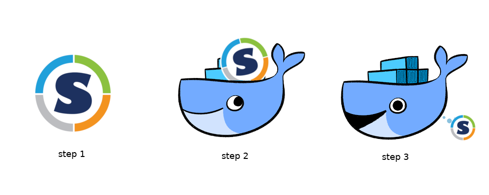

# Singularity in Docker

This is a proof of concept for packaging a Singularity container in a Docker
image, only with purpose to store it in a Docker Registry for pulling later.
Of course you'd need Docker or a tool like [oras](https://github.com/deislabs/oras) to handle the pull.
Use at your own risk! I don't know if there are rules against this sort of thing.



## Build

Build the Singularity container.

```bash
$ sudo singularity build busybox.sif Singularity
```

Then test it:

```bash
$ ./busybox.sif
```

then build the docker container, giving the Singularity container as a build arg.

```bash
$ docker build -t vanessa/singularity-in-docker --build-arg container=busybox.sif .
```

Make sure it's there:

```bash
$ docker run -it vanessa/singularity-in-docker 
/ # ls /
bin          dev          home         root         tmp          var
busybox.sif  etc          proc         sys          usr
```

Then push to wherever you like! When it's time to pull and use:

```bash
$ docker pull vanessa/singularity-in-docker
```

You can run with a different entrypoint, detached, to keep it running:

```bash
$ docker run -d --rm --name squiggles vanessa/singularity-in-docker tail -f /dev/null
```

Then copy the Singularity container:

```bash
$ docker cp squiggles:/busybox.sif exported-busybox.sif
```

Tada!

```bash
$ ./exported-busybox.sif 
Run run run run runnnnn!
```

And stop your squiggles.

```bash
$ docker stop squiggles
```
